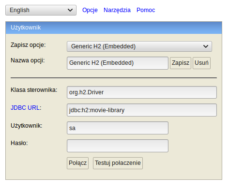

# Movie library

## Context

Your task will be to create a small microservice for a movie library in Java 8. Preferably you would use a framework called Dropwizard.

1. The microservice should be self contained, meaning no other dependencies other than the build dependencies to run the software should be needed.
1. Define a movie model with required and optional fields you think are crucial now and in future.
1. There is no need to persist the data. The movie data can be kept in memory.
1. Implement basic CRUD operations and endpoints for the movie object
1. Implement an endpoint to filter movies (by release-year, duration, actor)
1. Write down a small description on how you would store the data in a database (NoSQL vs SQL) and explain your choice

## How to start the Movie library application

### In the dev mode
1. First run h2 db by `run_dev_db.sh`
1. 
1. Click `connect`
1. Second run app by `run_dev_app.sh`

### In the release mode
1. run app by `run_release_app.sh`

### Manual

1. Run `(mvnw|mvnw.cmd) clean install` to build your application
1. Start application with `java -jar target/movie-library-0.0.1-SNAPSHOT.jar server config.yml`
1. To check that your application is running enter url `http://localhost:8080`

Health Check
---

To see your applications health enter url `http://localhost:8081/healthcheck`
